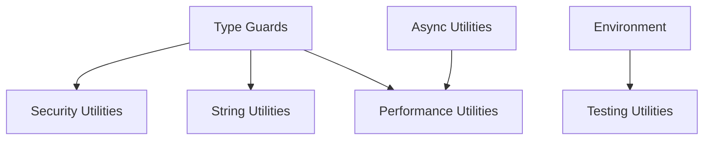

# Utility Implementation Tracker

## Overview

Single source of truth for all utility extraction and implementation across the Terroir Core Design System.

## Current Status (June 2025)

- ✅ **Phase 1 Complete**: Core async utilities extracted and tested
- 🚧 **Phase 2 Starting**: Type guards and security utilities
- 📋 **Phase 3-5 Planned**: String, performance, and other utilities

## Implementation Phases

### ✅ Phase 1: Async Utilities (COMPLETED)

**Location**: `packages/core/src/utils/async/`
**Status**: Implemented, tested, and integrated
**Coverage**: 71.87%

**Completed Components**:
- ✅ `withTimeout` - Add timeout to any promise
- ✅ `combineSignals` - Merge multiple AbortSignals
- ✅ `createTimeoutSignal` - Create timeout-based AbortSignal
- ✅ `isAbortError` - Type guard for abort errors
- ✅ `delay` - Promise-based delay utility
- ✅ `waitFor` - Wait for condition with timeout
- ✅ `pRetry` - Retry operations with exponential backoff

### 🚧 Phase 2: Type Guards & Security (IN PROGRESS)

#### Type Guards (`packages/core/src/utils/guards/`)
**Status**: Specification complete, implementation started
**Timeline**: Week 1-2

**Components to Extract**:
- 🔲 `isNonNullable` - Filter null/undefined
- 🔲 `hasProperty` - Safe property checking
- 🔲 `isPromiseLike` - Promise detection
- 🔲 `isError` - Error type guard
- 🔲 `isPlainObject` - Plain object detection
- 🔲 `isEmptyObject` - Empty object check
- 🔲 `hasRequiredProperties` - Multiple property validation

#### Security Utilities (`packages/core/src/utils/security/`)
**Status**: Planned
**Timeline**: Week 2-3

**Components to Extract**:
- 🔲 `redact` - Sensitive data redaction
- 🔲 `sanitize` - Input sanitization
- 🔲 `hashData` - Consistent hashing
- 🔲 `maskSensitive` - Partial masking
- 🔲 `validateSafePattern` - Pattern validation

### 📋 Phase 3: String & Performance (PLANNED)

#### String Utilities (`packages/core/src/utils/string/`)
**Timeline**: Week 3-4

**Components to Extract**:
- 🔲 `truncate` - Smart string truncation
- 🔲 `ellipsis` - Add ellipsis to strings
- 🔲 `slugify` - URL-safe strings
- 🔲 `camelCase` - Case conversion
- 🔲 `pascalCase` - Case conversion
- 🔲 `splitWords` - Word boundary detection
- 🔲 `formatBytes` - Human-readable bytes
- 🔲 `formatDuration` - Human-readable time

#### Performance Utilities (`packages/core/src/utils/performance/`)
**Timeline**: Week 4-5

**Components to Extract**:
- 🔲 `measureTime` - Execution timing
- 🔲 `measureMemory` - Memory usage
- 🔲 `createBenchmark` - Benchmark harness
- 🔲 `throttle` - Rate limiting
- 🔲 `debounce` - Event debouncing
- 🔲 `memoize` - Function memoization

### 📋 Phase 4: Environment & Testing (PLANNED)

#### Environment Utilities (`packages/core/src/utils/environment/`)
**Timeline**: Week 5-6

**Components to Extract**:
- 🔲 `isNode` - Node.js detection
- 🔲 `isBrowser` - Browser detection
- 🔲 `isDevelopment` - Dev environment
- 🔲 `isProduction` - Prod environment
- 🔲 `isTest` - Test environment
- 🔲 `getEnvironment` - Environment info
- 🔲 `supportsColor` - Color support

#### Testing Utilities (`packages/core/src/utils/testing/`)
**Timeline**: Week 6-7

**Components to Extract**:
- 🔲 `createMockLogger` - Logger mocking
- 🔲 `createTestContext` - Test context
- 🔲 `waitForExpect` - Async assertions
- 🔲 `mockTimers` - Timer mocking
- 🔲 `createFixture` - Test fixtures

### 📋 Phase 5: Advanced Utilities (FUTURE)

#### Circuit Breaker (`packages/core/src/utils/circuit-breaker/`)
**Timeline**: TBD

**Components**:
- 🔲 `CircuitBreaker` - Main implementation
- 🔲 `CircuitBreakerError` - Specific errors
- 🔲 `createBreaker` - Factory function

#### Data Transformation (`packages/core/src/utils/data/`)
**Timeline**: TBD

**Components**:
- 🔲 `pick` - Object property selection
- 🔲 `omit` - Object property removal
- 🔲 `merge` - Deep object merging
- 🔲 `clone` - Deep cloning
- 🔲 `flatten` - Array flattening
- 🔲 `groupBy` - Array grouping

## Utility Inventory

| Utility | Source | Priority | Status | Spec | Tests | Integrated |
|---------|--------|----------|--------|------|-------|------------|
| **Async Utilities** |
| withTimeout | errors/retry.ts | ✅ Critical | Done | ✓ | ✓ | ✓ |
| combineSignals | errors/retry.ts | ✅ Critical | Done | ✓ | ✓ | ✓ |
| delay | multiple | ✅ Critical | Done | ✓ | ✓ | ✓ |
| pRetry | new | ✅ Critical | Done | ✓ | ✓ | ✓ |
| **Type Guards** |
| isNonNullable | errors/base.ts | 🔴 Critical | Planned | ✓ | - | - |
| hasProperty | errors/validation.ts | 🔴 Critical | Planned | ✓ | - | - |
| isError | multiple | 🔴 Critical | Planned | ✓ | - | - |
| **Security** |
| redact | logger | 🔴 Critical | Planned | ✓ | - | - |
| sanitize | logger | 🔴 Critical | Planned | ✓ | - | - |
| **String Formatting** |
| truncate | logger/formatter.ts | 🔥 High | Planned | - | - | - |
| formatBytes | logger/formatter.ts | 🔥 High | Planned | - | - | - |
| **Performance** |
| measureTime | logger/performance.ts | 🔥 High | Planned | ✓ | - | - |
| throttle | new | 🔥 High | Planned | ✓ | - | - |
| **Environment** |
| isNode | multiple | 🎯 Medium | Planned | ✓ | - | - |
| isDevelopment | multiple | 🎯 Medium | Planned | ✓ | - | - |
| **Testing** |
| createMockLogger | test files | 🎯 Medium | Planned | ✓ | - | - |
| waitForExpect | test files | 🎯 Medium | Planned | ✓ | - | - |

## Migration Status

### Modules to Update

| Module | Current State | Migration Status | Notes |
|--------|--------------|------------------|--------|
| errors/base.ts | Uses internal helpers | 🔲 Pending | Need type guards |
| errors/retry.ts | Source of async utils | ✅ Migrated | Using shared utils |
| logger/index.ts | Has security utils | 🔲 Pending | Extract redaction |
| logger/formatter.ts | Has string utils | 🔲 Pending | Extract formatting |
| logger/performance.ts | Has perf utils | 🔲 Pending | Extract measuring |

## Success Metrics

### Code Reduction
- **Target**: 1500+ lines removed through deduplication
- **Current**: 300 lines (async utilities)
- **Remaining**: ~1200 lines

### Module Count
- **Target**: 20+ modules using shared utilities
- **Current**: 5 modules
- **Remaining**: 15+ modules

### Test Coverage
- **Target**: 90%+ coverage for all utilities
- **Current**: 71.87% (async only)
- **Gap**: Need to improve async coverage and test all new utilities

### Performance Impact
- **Bundle Size**: Track size reduction from deduplication
- **Runtime**: Ensure no performance regression
- **Tree Shaking**: Verify utilities are tree-shakeable

## Dependencies

### Internal Dependencies

### External Dependencies
- None for core utilities (zero-dependency goal)
- Dev dependencies for testing only

## Testing Requirements

### Per Utility Type

#### Type Guards
- Type narrowing verification
- Edge case handling
- TypeScript type tests

#### Async Utilities
- Cleanup verification
- Cancellation support
- Error propagation

#### Security Utilities
- Penetration testing
- Pattern validation
- Performance under load

#### Performance Utilities
- Benchmark baselines
- Memory leak detection
- Accuracy verification

## Timeline Summary

| Week | Focus | Deliverables |
|------|-------|--------------|
| 1-2 | Type Guards | Complete guard utilities with tests |
| 2-3 | Security | Extract and test security utilities |
| 3-4 | String Formatting | String manipulation utilities |
| 4-5 | Performance | Performance measurement tools |
| 5-6 | Environment | Environment detection utilities |
| 6-7 | Testing | Test helper utilities |
| 8+ | Advanced | Circuit breaker, data transformation |

## Next Actions

1. ✅ Complete async utility documentation
2. 🚧 Implement type guard utilities
3. 📋 Extract security utilities from logger
4. 📋 Create string formatting utilities
5. 📋 Set up performance benchmarking

## Notes

- All utilities must be tree-shakeable
- Zero runtime dependencies goal
- Each utility needs comprehensive tests
- Documentation required for all public APIs
- Performance benchmarks for critical paths