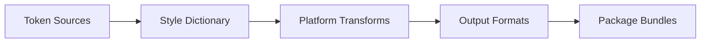
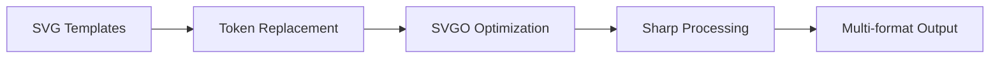

# Terroir Core Architecture

## System Overview

Terroir Core is a comprehensive design system built on modern web standards, featuring automated color generation, token management, and multi-format asset processing.

## Core Architecture Principles

### 1. Token-First Design

**Three-tier token system**:

- **Primitives**: Raw design values (`color.blue.500`)
- **Semantic**: Meaningful aliases (`color.primary`)
- **Component**: Specific use cases (`button.background.hover`)

### 2. Build-Time Resolution

All tokens are resolved at build time for:

- Zero runtime overhead
- Type safety via TypeScript
- Tree-shaking support
- Platform-specific outputs

### 3. Material Color Utilities Integration

```text
// Color generation flow
source color → Material algorithm → Tonal palettes → Theme tokens
```

Key features:

- Perceptually uniform color spaces
- Automatic contrast compliance
- Theme variant generation
- Continuous tone scales (0-100)

## Package Architecture

```markdown
@terroir/core
├── /guards     # Type guards and validation
├── /errors     # Typed error system
├── /logger     # Structured logging
└── /async      # Async utilities

@terroir/tokens
├── /base       # Primitive tokens
├── /themes     # Theme variations
└── /brands     # Multi-brand support

@terroir/react
├── /components # React components
├── /hooks      # Shared hooks
└── /utils      # React utilities
```

## Build Pipeline

### Token Processing Pipeline



1. **Input**: JSON token definitions
2. **Transform**: Style Dictionary processors
3. **Validate**: WCAG contrast checking
4. **Output**: CSS, JS, iOS, Android formats

### Asset Processing Pipeline



1. **SVG Processing**: Token placeholders replaced
2. **Optimization**: SVGO with custom plugins
3. **Rasterization**: PNG/WebP generation
4. **Distribution**: CDN-ready assets

## Key Design Decisions

### Why Material Color Utilities?

- **Scientific basis**: Perceptually uniform color generation
- **Accessibility**: Built-in contrast algorithms
- **Flexibility**: Multiple theme variants
- **Google standard**: Industry-proven approach

### Why Style Dictionary?

- **Extensibility**: Custom transforms and formats
- **Multi-platform**: Native mobile support
- **Community**: Large ecosystem
- **Flexibility**: Handles complex token relationships

### Why TypeScript Throughout?

- **Type safety**: Catch errors at build time
- **IntelliSense**: Better developer experience
- **Documentation**: Types serve as docs
- **Refactoring**: Confident code changes

## Integration Points

### For Applications

```typescript
// Direct token import
import { colors, spacing } from '@terroir/tokens';

// React components
import { Button, Card } from '@terroir/react';

// Utilities
import { logger, guards } from '@terroir/core';
```

### For Build Tools

- **Webpack**: Custom loaders for tokens
- **Vite**: Plugin for hot reload
- **Next.js**: Automatic optimization
- **Rollup**: Tree-shaking support

### For CI/CD

- **Testing**: Automated visual regression
- **Validation**: Contrast compliance
- **Publishing**: Automated releases
- **Documentation**: Auto-generated

## Performance Considerations

### Build Performance

- Incremental token builds
- Parallel asset processing
- Cached transformations
- Optimized file watching

### Runtime Performance

- Zero-overhead tokens
- Lazy-loaded components
- Optimized bundle sizes
- Progressive enhancement

### Development Performance

- Hot module replacement
- Fast rebuilds
- Incremental type checking
- Efficient file watching

## Security Model

### Token Security

- No runtime token generation
- Validated at build time
- Type-safe access only
- No dynamic evaluation

### Asset Security

- SVG sanitization
- Path traversal prevention
- Content type validation
- Checksum verification

## Future Architecture

### Planned Enhancements

1. **Web Components**: Framework-agnostic components
2. **CSS Layers**: Modern cascade control
3. **Container Queries**: Responsive components
4. **View Transitions**: Smooth animations

### Scaling Considerations

- Monorepo optimizations
- Distributed builds
- Edge deployment
- Global CDN distribution

## AI Metadata

```text
stability: stable
token_cost: 1200
last_updated: 2025-06-29
```
