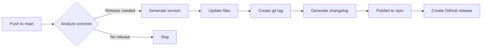

# Release Strategy

This document outlines the release process for the Terroir Core Design System.

## Overview

We use **semantic versioning** and **automated releases** powered by semantic-release. Releases are triggered automatically when commits are pushed to the `main` branch.

## Version Strategy

### Semantic Versioning (SemVer)

We follow [Semantic Versioning 2.0.0](https://semver.org/):

```
MAJOR.MINOR.PATCH
```

- **MAJOR**: Breaking changes
- **MINOR**: New features (backwards compatible)
- **PATCH**: Bug fixes (backwards compatible)

### Pre-release Versions

- **Alpha**: `1.0.0-alpha.1` - Early testing, unstable API
- **Beta**: `1.0.0-beta.1` - Feature complete, testing phase
- **RC**: `1.0.0-rc.1` - Release candidate, final testing

## Automated Release Process

### 1. Commit Convention

Releases are determined by commit messages:

| Commit Type        | Release Type | Version Bump      | Example                                   |
| ------------------ | ------------ | ----------------- | ----------------------------------------- |
| `fix:`             | Patch        | `1.0.0` → `1.0.1` | `fix: correct color contrast calculation` |
| `feat:`            | Minor        | `1.0.0` → `1.1.0` | `feat: add new button component`          |
| `BREAKING CHANGE:` | Major        | `1.0.0` → `2.0.0` | `feat!: change token naming convention`   |
| `chore:`           | No release   | -                 | `chore: update dependencies`              |
| `docs:`            | No release   | -                 | `docs: update README`                     |

### 2. Release Workflow



### 3. Triggered Actions

When a release is triggered:

1. **Version bump** in package.json files
2. **CHANGELOG.md** generation
3. **Git tag** creation
4. **npm publish** for all packages
5. **GitHub release** with notes
6. **Documentation** deployment

## Release Channels

### Stable Releases

- Branch: `main`
- npm tag: `latest`
- Example: `1.2.3`

### Beta Releases

- Branch: `beta`
- npm tag: `beta`
- Example: `1.2.3-beta.1`

Configuration in `.releaserc.json`:

```json
{
  "branches": [
    "main",
    {
      "name": "beta",
      "prerelease": true
    }
  ]
}
```

### Canary Releases

For testing specific features:

```bash
# Manual canary release
npm version prerelease --preid=canary
npm publish --tag canary
```

## Manual Release Process

If automated release fails:

### 1. Prepare Release

```bash
# Ensure clean working directory
git status

# Update to latest main
git checkout main
git pull origin main

# Run tests
pnpm test
pnpm build
```

### 2. Create Release

```bash
# Dry run to see what would happen
pnpm exec semantic-release --dry-run

# Actual release
pnpm exec semantic-release
```

### 3. Verify Release

- Check npm registry: `npm view @terroir/core`
- Check GitHub releases page
- Verify documentation deployment

## Hotfix Process

For critical bugs in production:

### 1. Create Hotfix Branch

```bash
# From the tag that needs fixing
git checkout -b hotfix/1.2.4 v1.2.3
```

### 2. Apply Fix

```bash
# Make changes
git add .
git commit -m "fix: critical bug in color calculation"
```

### 3. Release Hotfix

```bash
# Merge to main
git checkout main
git merge hotfix/1.2.4
git push origin main

# Automated release will trigger
```

## Package Publishing

### Monorepo Coordination

All packages are versioned together:

- `@terroir/core` - Core tokens
- `@terroir/react` - React components
- `@terroir/web-components` - Web components

### npm Configuration

Publishing settings in `package.json`:

```json
{
  "publishConfig": {
    "access": "public",
    "registry": "https://registry.npmjs.org/"
  }
}
```

### Pre-publish Checks

Automated checks before publish:

1. **Lint** passes
2. **Tests** pass
3. **Build** succeeds
4. **Size limits** met
5. **Types** generate correctly

## Changelog Management

### Automatic Generation

CHANGELOG.md is updated automatically with:

- Version and date
- Grouped changes by type
- Links to commits and issues
- Breaking change warnings

### Manual Additions

For important context, edit before release:

```markdown
## [1.2.0] - 2024-06-25

### Added

- New color system with Material You support

### Migration Guide

To migrate from v1.1.x:

1. Update color token references
2. Run migration script: `npx @terroir/migrate`
```

## Communication

### Release Announcements

1. **GitHub Release**: Auto-generated
2. **Discord/Slack**: Post in #releases
3. **Twitter/Social**: Major releases only
4. **Blog Post**: Breaking changes

### Template

```markdown
🎉 Terroir Core v1.2.0 Released!

✨ Highlights:

- Feature 1
- Feature 2

📚 Docs: https://terroir.design
📦 npm: npm install @terroir/core@1.2.0
🔄 Changelog: https://github.com/terroir-ds/core/releases/tag/v1.2.0
```

## Rollback Procedure

If a release has critical issues:

### 1. Deprecate Bad Version

```bash
npm deprecate @terroir/core@1.2.3 "Critical bug, use 1.2.4"
```

### 2. Publish Patch

Follow hotfix process above

### 3. Communicate

- Update GitHub release notes
- Post in communication channels
- Email major users if needed

## Release Schedule

### Regular Releases

- **Weekly**: Patch releases (fixes)
- **Bi-weekly**: Minor releases (features)
- **Quarterly**: Major releases (if needed)

### Feature Flags

For gradual rollout:

```javascript
// tokens/config.js
export const features = {
  newColorSystem: process.env.FEATURE_NEW_COLORS === 'true',
  experimentalComponents: false,
};
```

## Monitoring

### Post-Release Checks

1. **npm downloads**: Monitor adoption
2. **GitHub issues**: Watch for problems
3. **Bundle size**: Track package growth
4. **Performance**: Monitor benchmarks

### Metrics Dashboard

Track key metrics:

- Download counts
- Version adoption rate
- Issue velocity
- Bundle size trends

## Security Releases

For security vulnerabilities:

1. **Private fix**: Develop in security branch
2. **Coordinate**: With security researchers
3. **Release**: All affected versions
4. **Announce**: After patches available
5. **CVE**: File if necessary

## Migration Support

### Breaking Changes

Provide migration tools:

```bash
npx @terroir/migrate@latest
```

### Codemods

Automated code updates:

```javascript
// codemods/v2-token-names.js
module.exports = function (fileInfo, api) {
  // Transform code
};
```

### Documentation

- Migration guide for each major version
- Video tutorials for complex changes
- Before/after examples

## Troubleshooting

### Common Issues

1. **Release not triggered**
   - Check commit message format
   - Verify CI passed
   - Check branch permissions

2. **npm publish failed**
   - Verify npm token
   - Check registry status
   - Retry with `npm publish`

3. **Partial release**
   - Check each package
   - Manual publish if needed
   - Update git tags

### Emergency Contacts

- npm support: support@npmjs.com
- GitHub support: via web portal
- Team lead: @your-username

## Appendix

### Useful Commands

```bash
# Check what would be released
pnpm exec semantic-release --dry-run

# View recent releases
git tag -l --sort=-version:refname

# Check package versions
npm view @terroir/core versions

# Verify package contents
npm pack --dry-run
```

### Related Documents

- [Git Workflow](./git-workflow.md)
- [Contributing Guide](../CONTRIBUTING.md)
- [Branch Protection](./github-branch-protection.md)
